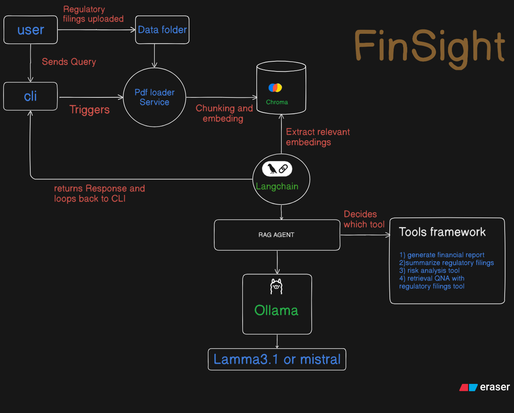

# 📊 Finsight – AI-Powered Financial Analyst Assistant

**Finsight** is an intelligent assistant that automates financial analysis, anomaly detection, and risk profiling using Retrieval-Augmented Generation (RAG), LangChain agents, and local LLMs via Ollama. It parses financial documents, answers company-specific queries, and generates structured PDF reports — empowering analysts, investors, and enterprise decision-makers.

---

## 🚀 Features

- ✅ **Financial Report Generation**
- 🔍 **Retrieval-Augmented QA (RAG)**
- 🚨 **Anomaly Detection**
- ⚠️ **Risk Report Generation**
- 📄 **PDF Output**
- 🤖 **LangChain Agent Tools**
- 🧪 **CLI Interface**

---
##  🔧 System Design


---
## 🛠️ Tech Stack

| Layer          | Technology                     |
|----------------|--------------------------------|
| Language Model | [Ollama](https://ollama.ai/) – `mistral` |
| Framework      | [LangChain](https://www.langchain.com/) |
| Retrieval      | FAISS Vectorstore               |
| Embedding Mgmt | Custom loader + embedding manager |
| PDF Generation | `fpdf`                          |
| Interface      | Python CLI + LangChain Agents   |

---

## 🧩 Tools Implemented

| Tool Name                | Purpose                                                   |
|--------------------------|-----------------------------------------------------------|
| `generate_financial_report` | Creates a structured PDF financial report               |
| `retrieval_qa`              | Answers user questions using retrieved financial docs   |
| `detect_anomalies`          | Detects irregular patterns in company data              |
| `generate_risk_report`      | Generates a risk profile and warning report              |

---

## 📁 Project Structure

```bash
finsight/
├── app/
│   ├── cli/                  # Command-line interface logic
│   ├── embeddings/           # Vectorstore setup and embedding manager
│   ├── tools/                # Tool definitions for the LangChain agent
│   └── utils/                # PDF and formatting helpers
├── output/
│   └── report/               # Auto-generated PDF reports
├── main.py                   # CLI Entry point
├── requirements.txt
└── README.md

```
---

## ⚙️ Setup & Running Instructions
```bash
git clone https://github.com/your-username/finsight.git
cd finsight
```

2. Create and Activate a Virtual Environment
```bash
Copy
Edit
python -m venv venv
source venv/bin/activate        # macOS/Linux
venv\Scripts\activate
ollama run mistral
python main.py
```


          

